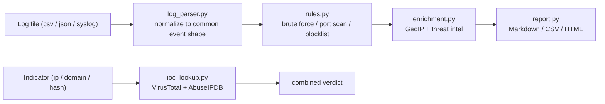

# SOC Automation Toolkit

[](https://github.com/ara-5/soc_automation_toolkit/actions/workflows/ci.yml)
[](LICENSE)
[](pyproject.toml)

A small CLI that automates the parts of SOC analyst triage that are the
most repetitive: pulling context on an indicator, sweeping a log for
known attack patterns, and turning the result into something you can
hand to a report or a ticket.

```
$ soc-toolkit scan-logs samples/sample_auth.csv --blocklist samples/blocklist.txt
Parsed 6 log entries from samples/sample_auth.csv
Triggered 1 alert(s)
# SOC Alert Report

Total alerts: 1

| Severity | Rule        | Source IP    | Verdict | Country | Description                                       |
|----------|-------------|--------------|---------|---------|----------------------------------------------------|
| high     | brute_force | 203.0.113.5  | unknown |         | 5 failed logins from 203.0.113.5 within 0:10:00     |
```

## Why this exists

Most SOC-facing "toolkits" I found while learning this material were
either single-file scripts glued to one API, or too abstract to run
against a real log. This one is deliberately narrow: three things a
tier-1 analyst actually does by hand — look up an IOC, triage a log,
enrich and report an alert — implemented as a real, tested CLI rather
than a notebook.

## What it does

- **IOC lookup** — classify and check an IP, domain, or file hash
  against VirusTotal and AbuseIPDB, with a combined verdict.
- **Log parsing & triage** — ingest CSV, JSON, or raw SSH auth-log
  text and normalize it into one event shape, then run it through a
  small rule engine.
- **Enrichment & reporting** — attach GeoIP and threat-intel context
  to triggered alerts and render Markdown, CSV, or HTML output.

## Architecture



Everything that talks to the network (`ioc_lookup.py`, the GeoIP call
in `enrichment.py`) is isolated behind small functions so the test
suite can mock it — no API keys or internet access are needed to run
`pytest`.

## Detection rules

| Rule | Trigger |
|---|---|
| `brute_force` | 5+ failed logins from the same source IP within a 10-minute window |
| `port_scan` | a source IP touches 15+ distinct destination ports within 5 minutes |
| `known_bad_ip` | any event from an IP on the supplied `--blocklist` file |

## Install

```bash
git clone https://github.com/ara-5/soc_automation_toolkit.git
cd soc_automation_toolkit
python -m venv env
env\Scripts\activate        # on Windows
# source env/bin/activate   # on macOS/Linux
pip install -e ".[dev]"
```

This installs the `soc-toolkit` command on your PATH. Set API keys as
environment variables if you want live threat-intel lookups — both
are optional, and the toolkit degrades gracefully (clearly noting
what it skipped) without them:

```bash
set VT_API_KEY=your-virustotal-key
set ABUSEIPDB_API_KEY=your-abuseipdb-key
```

## Usage

```bash
# Look up an indicator
soc-toolkit lookup 8.8.8.8
soc-toolkit lookup evil.example.com --json

# Parse a log, run detection rules, print a Markdown report
soc-toolkit scan-logs samples/sample_auth.csv

# Same, with a blocklist, live enrichment, and an HTML report on disk
soc-toolkit scan-logs samples/sample_auth.csv \
    --blocklist samples/blocklist.txt --enrich --output report.html
```

Supported log formats: `csv`, `json` (array or JSON Lines), and
`syslog` (SSH auth-log style `Failed password` / `Accepted password`
lines). Format is auto-detected from the file extension, or force it
with `--format`.

## Development

```bash
pip install -e ".[dev]"
ruff check .                # lint
pytest --cov=soc_automation_toolkit --cov-report=term-missing
```

The suite currently covers 33 test cases across the parser, rule
engine, enrichment, reporting, and the CLI end-to-end — all network
calls mocked, so it runs offline and in CI on every push.

## Roadmap

- Additional log sources: Windows Event Log (EVTX), Zeek `conn.log`
- Alert delivery: Slack / webhook notification on `--enrich`
- A `--watch` mode for tailing a live log instead of a static file

## License

MIT — see [LICENSE](LICENSE).
